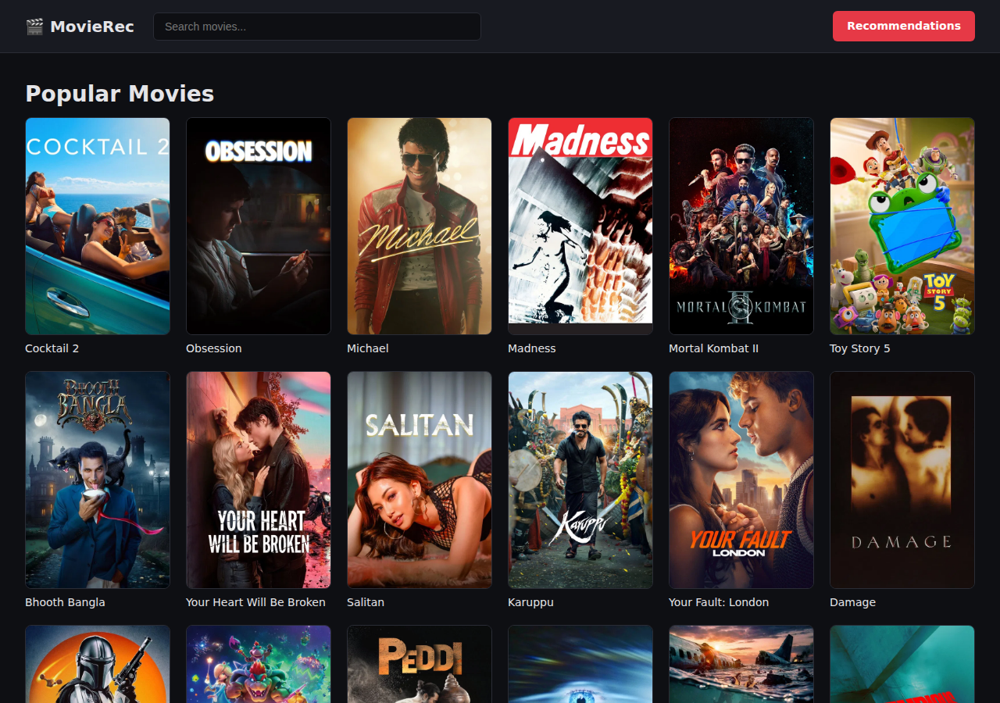
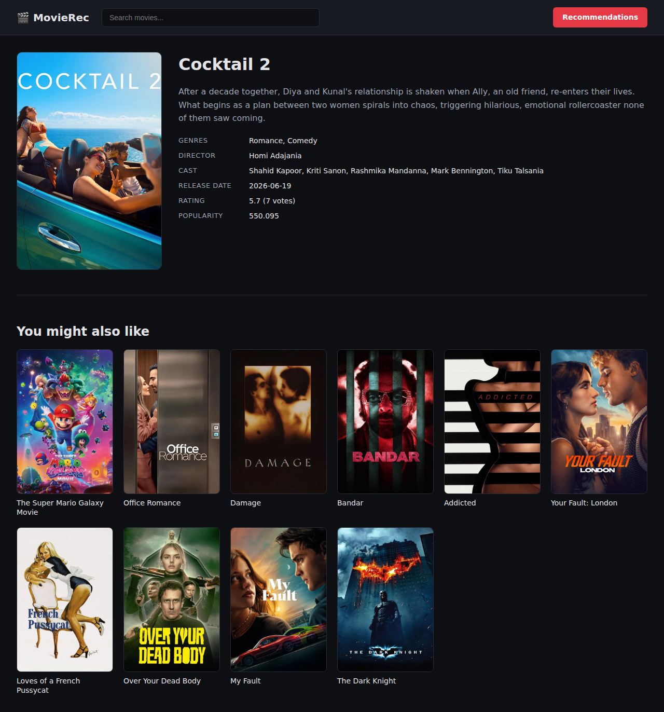
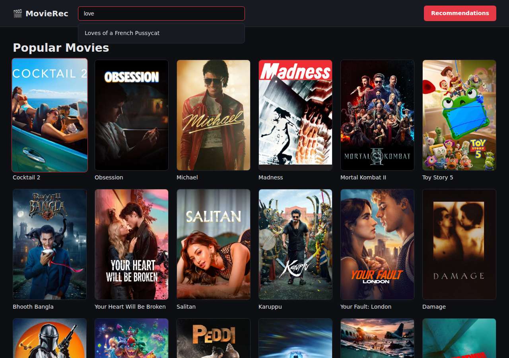
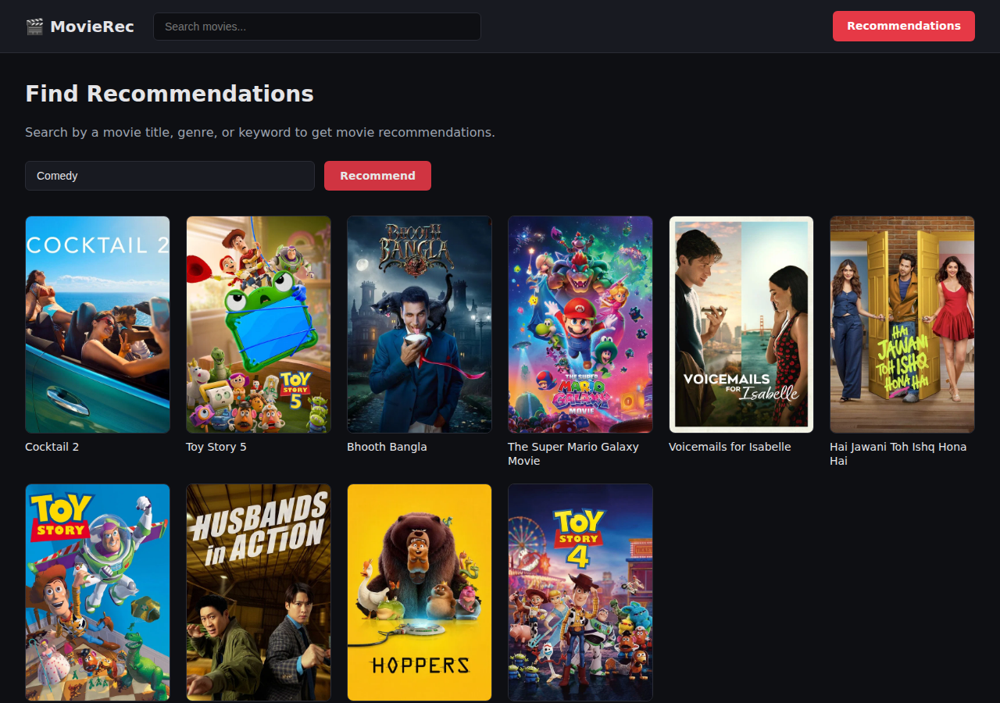

# 🎬 Movie Recommendation Engine

A full-stack movie recommender: real TMDB data flows through a small data
pipeline, gets turned into a content-based similarity model, and is served
up through a FastAPI backend and an Angular frontend you can actually click
around in.

If you just want to see it: scroll to the screenshots. If you want to run
it yourself or poke at the code: keep reading.

## What it looks like

**Landing page** — every movie, fetched live from the API, posters and all.



**Movie details** — full info plus a "you might also like" row powered by
the similarity model.



**Live search** — navbar search with a debounced dropdown as you type (RxJS `debounceTime` + `switchMap`).



**Recommendations by genre/keyword** — not just "movies like this movie",
you can also just type a vibe ("Comedy", "heist", "time travel") and get a
list back.



## Where things stand

This is being built incrementally, so here's the honest status:

- [x] TMDB ingestion job (popular movies + full credits/keywords)
- [x] Data cleaning/flattening into a queryable table
- [x] TF-IDF + cosine similarity model for "similar movies"
- [x] FastAPI backend with movie + recommendation endpoints
- [x] Angular frontend — landing grid, movie detail page, live search, genre/keyword recommendations (RxJS throughout)
- [x] Verified end-to-end in a real browser (caught and fixed a duplicate-data bug and a dev-server routing bug doing this)
- [x] Monorepo split — `backend/` (Vercel) and `frontend/` (AWS Amplify) deploy independently
- [ ] Pagination on the movie grid (currently loads all ~99 movies at once — fine for now, won't scale forever)
- [ ] No tests yet
- [ ] No auth / user accounts — recommendations are global, not personalized to a user

## Project structure

```
Movie_Recommendation_Engine/
├── backend/               ← FastAPI + data pipeline (deploys to Vercel)
│   ├── app/               ← API routes and services
│   │   ├── main.py
│   │   ├── routers/
│   │   └── services/
│   ├── api/
│   │   └── index.py       ← Vercel entrypoint
│   ├── jobs/              ← One-off data pipeline scripts
│   ├── delta/             ← Delta Lake (bronze/silver/gold)
│   ├── requirements.txt
│   └── vercel.json
├── frontend/              ← Angular SPA (deploys to AWS Amplify)
│   ├── src/
│   │   ├── app/           ← Components, pages, services
│   │   └── environments/  ← Dev and prod API base URL config
│   ├── angular.json
│   └── proxy.conf.json    ← Dev proxy to local backend
├── amplify.yml            ← AWS Amplify build config
├── docs/screenshots/
└── README.md
```

## How it actually works

Think of it as three small jobs feeding a Delta Lake, and an API + UI
sitting on top of the result:

```
TMDB API → ingest → bronze → transform → silver → similarity model → gold → API → UI
```

**The pipeline** (`backend/jobs/`) — three scripts you run in order:
- `ingest_tmdb.py` hits the TMDB API for popular movies + their full credits/keywords and dumps the raw JSON into a **bronze** Delta table.
- `transform_movies.py` flattens that raw JSON into clean columns (title, genres, cast, director, keywords...) — the **silver** table the app actually queries.
- `build_similarity.py` runs TF-IDF + cosine similarity over each movie's combined text (title/overview/genres/cast/director/keywords) and precomputes the top 10 most similar movies for every title, into the **gold** table.

**The backend** (`backend/app/`) — a thin FastAPI layer on top of those Delta tables:
- `routers/movies.py` — list/search/get individual movies
- `routers/recommendations.py` — get recommendations by movie id, by title, or by a free-text genre/keyword query
- `services/delta_reader.py` + `services/recommender.py` — the actual pandas logic behind those routes

**The frontend** (`frontend/`) — an Angular SPA with RxJS for async data flow:
- `LandingComponent` — the movie grid, fetches all movies on init
- `MovieDetailComponent` — one movie's full info + recommended titles (two chained HTTP requests via `switchMap`)
- `RecommendationsComponent` — the genre/keyword search, requests are cancellable via `Subject` + `switchMap`
- `NavbarComponent` — sitewide search with a live dropdown using `debounceTime` + `distinctUntilChanged`

No magic anywhere — it's intentionally simple so each layer is easy to reason about.

## Running it yourself

You'll need Python 3.10+, Node 18+, and a free [TMDB API key](https://www.themoviedb.org/settings/api).

```bash
# 1. add your key
echo "TMDB_API_KEY=your_key_here" > backend/.env

# 2. backend deps
cd backend && pip install -r requirements.txt && cd ..

# 3. frontend deps
cd frontend && npm install && cd ..

# 4. build the data (run once, or whenever you want fresh TMDB data)
cd backend
python jobs/ingest_tmdb.py
python jobs/transform_movies.py
python jobs/build_similarity.py
cd ..

# 5. run it
cd backend && uvicorn app.main:app --reload --port 8000   # -> http://localhost:8000
cd frontend && npx ng serve --port 4200                   # -> http://localhost:4200
```

The Angular dev server proxies `/movies/` and `/recommend/` to the backend
via `proxy.conf.json`, so the frontend just calls relative paths — no CORS
headaches in dev.

## Deployment

| Layer | Host | Config |
|-------|------|--------|
| Backend | Vercel | `backend/vercel.json` — set Root Directory to `backend` in Vercel settings |
| Frontend | AWS Amplify | `amplify.yml` at repo root — set `API_BASE_URL` env var to your Vercel URL |

## API endpoints

| Method | Path | What it does |
|--------|------|---------------|
| GET | `/movies/` | All movies |
| GET | `/movies/search?query=` | Search movies by title |
| GET | `/movies/{movie_id}` | One movie, full details |
| GET | `/recommend/{movie_id}` | Top 10 similar movies by id |
| GET | `/recommend/title/{title}` | Recommendations by title |
| GET | `/recommend/search?q=` | Recommendations by title, genre, or keyword |

Full interactive docs at `/docs` once the backend is running.

## Stack

Python, FastAPI, pandas, Delta Lake, scikit-learn (TF-IDF + cosine similarity) on the backend.
Angular 21, RxJS, Angular Router on the frontend.
